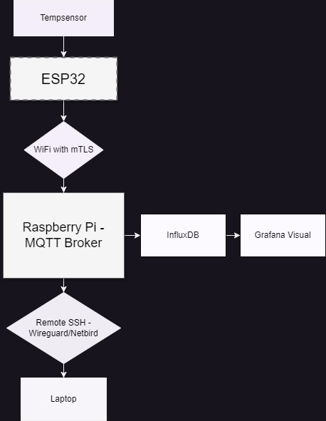
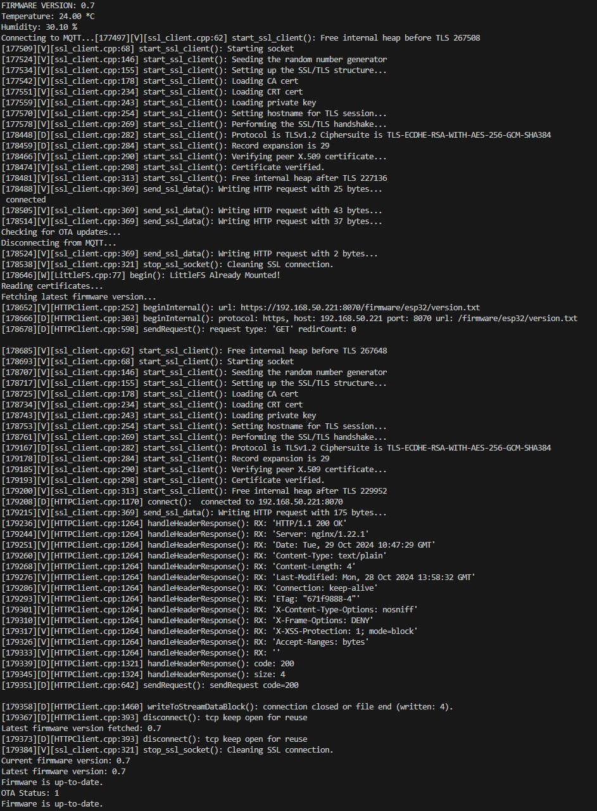
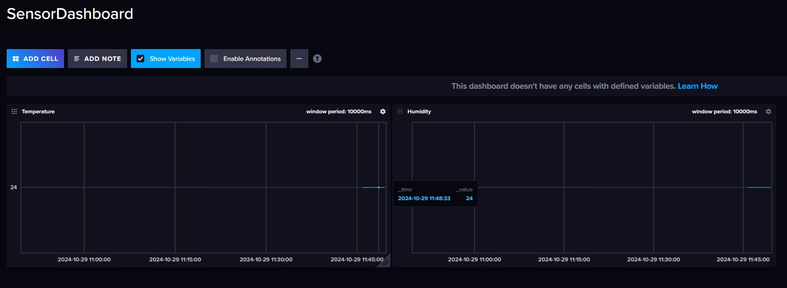
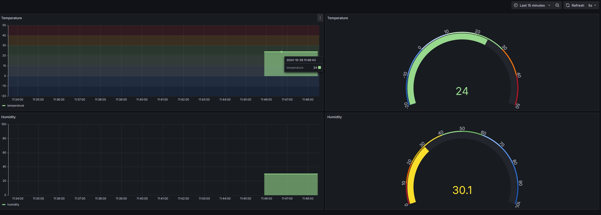

# IoT Temperature Monitoring System with Secure MQTT, Nginx, and OTA Updates

## Overview
This project demonstrates a secure IoT system for remote temperature monitoring, designed to align with the Cyber Resilience Act (CRA) for data integrity and resilience. Temperature data is transmitted from a sensor to a Raspberry Pi, stored in InfluxDB, and visualized using Grafana.

## Quick Start

For setup instructions, please refer to the [QUICKSTART.md](QUICKSTART.md) file.

---

## System Architecture
1. **Temperature Sensor**: The DHT11 sensor gathers temperature and humidity data, which is sent to the ESP32 for processing.
2. **ESP32 (Client)**: Interprets the sensor data and transmits it via MQTT over Wi-Fi to the Raspberry Pi using mutual TLS (mTLS) for secure, authenticated communication.
3. **Raspberry Pi 5 (Server)**: Acts as the MQTT broker, receiving data from the ESP32 and storing it in InfluxDB. Nginx serves as a secure server for hosting OTA firmware files for the ESP32.
4. **Nginx**: Provides secure HTTPS access for the ESP32 to download firmware files during OTA updates.
5. **InfluxDB**: A time-series database that securely stores sensor data.
6. **Grafana**: Provides real-time monitoring and visualization of the temperature data.

---

## Communications and Security Model
- **Secure Data Flow**: Data transfer is encrypted via mTLS, ensuring data integrity.
- **Certificate Authentication**: ESP32 and Raspberry Pi authenticate each other with certificates for authorized communication.
- **Data and Certificate Management**: Stored in **LittleFS** on ESP32 for secure handling.

---

## Compliance with Cyber Resilience Act (CRA)

- **Security-by-Design**: End-to-end encryption and authentication were built into the system to align with CRA's security standards.
- **Update Capability**: OTA updates are implemented through Nginx. Future improvements will include enhanced OTA mechanisms for continual security.
- **Vulnerability Management**: Error handling, logging, and planned CVE tracking in future releases support proactive threat management.

---

## System Specification

### Architecture
- **Components**:
  - **Sensor**: DHT11, connected to ESP32.
  - **Microcontroller**: ESP32 S3 WROOM for processing and secure data transmission.
  - **Server/Gateway**: Raspberry Pi 5, hosting the Mosquitto MQTT broker and Nginx for OTA file serving.
  - **Database**: InfluxDB for secure storage of time-series data.
  - **Visualization**: Grafana for monitoring and analyzing sensor data.

### Communication Flow
1. The DTH11 sensor reads data and sends it to the ESP32.
2. ESP32 transmits data over Wi-Fi using mTLS to the Raspberry Pi’s MQTT broker.
3. The Raspberry Pi stores incoming data in InfluxDB.
4. Grafana visualizes the data, making it accessible for analysis and real-time monitoring.
5. Nginx securely hosts OTA firmware files for the ESP32 to access.

### Security Measures
- **mTLS Configuration**:
  - **Certificates**:
    - Generated CA, server, and client certificates for mutual authentication.
    - `WiFiClientSecure` on the ESP32 enables mTLS connections.
  - **Mosquitto**:
    - Configured on the Raspberry Pi to enforce client authentication.
  - **Nginx**:
    - Configured on the Raspberry Pi to enforce HTTPS for OTA updates.
- **Data Security**:
  - Encryption of data in transit (mTLS) and at rest (SSL/TLS for InfluxDB and Nginx).
  - **Role-based Access**: Plans for user-specific permissions in Grafana will restrict dashboard access.
- **Firewall and Network Security**: Further network security configurations to prevent unauthorized access, such as a dedicated and separate Wi-Fi network for the ESP32, combined with a Netbird or WireGuard VPN setup for the Raspberry Pi.

### Future Cloud Integration
**Goal**: Enable secure, scalable access to sensor data in a cloud environment, enhancing accessibility and real-time monitoring capabilities.

**Implementation Plan**:
1. **Cloud Database Integration**: Migrate InfluxDB to a cloud provider, such as InfluxDB Cloud, Azure Cosmos DB, or MongoDB Atlas, to support time-series or document-oriented data.
2. **Secure Data Pipeline**: Use HTTPS/TLS encryption for data streaming to the cloud, with IP restrictions and access control.
3. **Grafana Cloud Dashboard**: Configure Grafana Cloud for remote access, providing real-time monitoring and advanced analytics capabilities.
4. **IoT Device Management**: Explore cloud-based solutions (e.g., AWS IoT Core or Azure IoT Hub) for expanded device management and monitoring.

---

### Secure OTA Updates
This system includes OTA updates for the ESP32 using HTTPS with certificate-based verification, hosted through Nginx. This approach ensures data integrity and security compliance with CRA standards.

#### OTA Update Process
1. **Version Check**: The ESP32 queries the Nginx server for the latest firmware version and compares it to its current version.
2. **Certificate-Based Authentication**: The ESP32 uses certificates stored in LittleFS for server verification.
3. **Firmware Download**: If a newer version is detected, the ESP32 securely downloads and installs the update before rebooting.

---

## Technologies Used
- **ESP32**: Microcontroller for data acquisition and secure transmission.
- **Raspberry Pi 5**: Acts as a secure server and MQTT broker.
- **Mosquitto**: mTLS-enabled MQTT broker for secure message transfer.
- **Nginx**: Securely hosts firmware files for OTA updates.
- **InfluxDB**: Time-series database for secure data storage.
- **Grafana**: Visualization dashboard for monitoring data.

---

## Future Improvements
- **Scalability**: Increase sensor count and consider cloud integration for broader data access.
- **Enhanced Security**: Implement multi-factor authentication for Grafana and strengthen network security configurations, such as isolating the ESP32 on a dedicated network.
- **Reliable Certificate Management**: Currently, both InfluxDB and MQTT connections use self-signed certificates. Moving to more reliable certificates, such as `Let’s Encrypt`, will strengthen security, especially in production environments, by enabling automated certificate renewal and validation.
- **TLS Certificate Validation**: Future improvements aim to fully validate certificates for both InfluxDB and MQTT connections, removing `tls_insecure_set(True)` and establishing secure, verified connections.
- **Secure Credential Storage**: InfluxDB tokens and other sensitive credentials are now managed with environment variables, improving security. Future updates could further enhance this with encrypted storage or a secrets management tool.
- **System Health Monitoring and Alerts**: Future versions of this PoC may integrate system health checks and alerts in Grafana to notify users of connection issues, certificate expiration, or OTA failures.
- **OTA Rollback Mechanism**: To ensure stability after updates, a rollback mechanism for OTA updates will be implemented. This feature will revert to the last known configuration if critical settings (e.g., network credentials) fail, maintaining functionality and minimizing downtime.
- **Predictive Analytics**: Explore machine learning models within Grafana for predictive monitoring and proactive maintenance alerts based on sensor data trends.

---

## Conclusion
This Proof of Concept meets Cyber Resilience Act standards, demonstrating a secure and scalable solution for IoT monitoring. Future cloud integration will further enhance accessibility, scalability, and security, preparing the system for production deployment.

## Examples - Screenshots

### ESP32 Serial Screenshot

*“ESP32 serial output showing firmware version, temperature and humidity readings, MQTT connection status, and TLS handshake for OTA updates.”*

### InfluxDB Screenshot

*“InfluxDB dashboard displaying timestamped sensor data points for temperature and humidity. Confirming that data is being implemented correctly, from the ESP32 to the Raspberry Pi.”*

### Grafana Screenshot

*“Grafana dashboard visualizing real-time temperature and humidity data, including gauge and line charts for easy monitoring.”*
